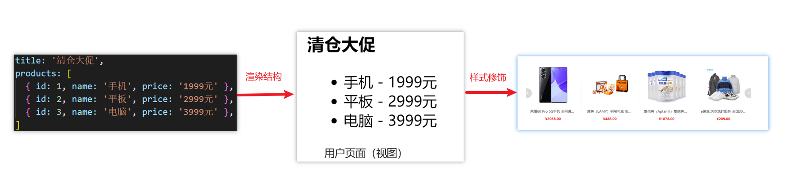
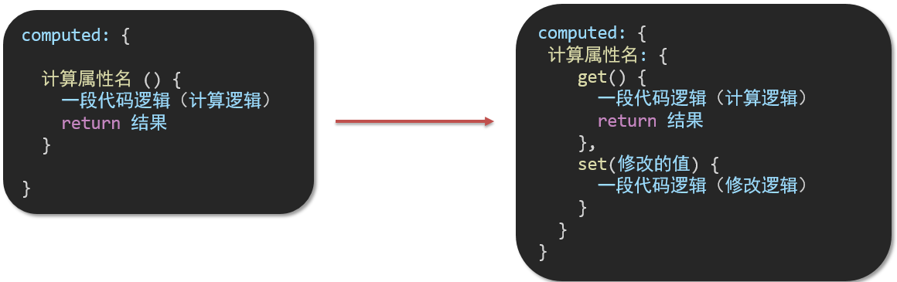
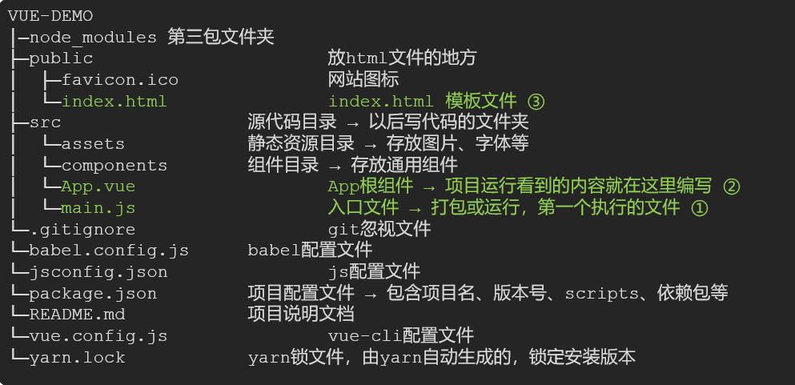
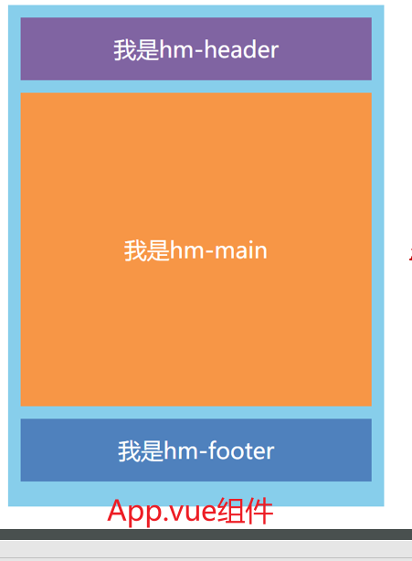

# vue2+3
# day01

## 一、为什么要学习Vue

1.前端必备技能

2.岗位多，绝大互联网公司都在使用Vue

3.提高开发效率

4.高薪必备技能（Vue2+Vue3）


## 二、什么是Vue

概念：Vue (读音 /vjuː/，类似于 view) 是一套 **构建用户界面 ** 的 **渐进式** **框架**

Vue2官网：<https://v2.cn.vuejs.org/>

### 1.什么是构建用户界面

**基于数据**渲染出用户可以看到的**界面**



### 2.什么是渐进式

所谓渐进式就是循序渐进，不一定非得把Vue中的所有API都学完才能开发Vue，可以学一点开发一点

#### Vue的两种开发方式：

1. Vue核心包开发

   场景：局部模块改造

2. Vue核心包&Vue插件&工程化

   场景：整站开发


### 3.什么是框架

所谓框架：就是一套完整的解决方案

**举个栗子**	

如果把一个完整的项目比喻为一个装修好的房子，那么框架就是一个毛坯房。

我们只需要在“毛坯房”的基础上，增加功能代码即可。

提到框架，不得不提一下库。

- 库，类似工具箱，是一堆方法的集合，比如 axios、lodash、echarts等
- 框架，是一套完整的解决方案，实现了大部分功能，我们只需要按照一定的规则去编码即可。

下图是 库 和 框架的对比。


框架的特点：有一套必须让开发者遵守的**规则**或者**约束**

咱们学框架就是学习的这些规则 [官网](https://v2.cn.vuejs.org/)

### 总结：什么是Vue？

Vue是什么：

什么是构建用户界面：

什么是渐进式：

什么是框架：


## 三、创建Vue实例

我们已经知道了Vue框架可以 基于数据帮助我们渲染出用户界面，那应该怎么做呢？


比如就上面这个数据，基于提供好的msg 怎么渲染后右侧可展示的数据呢？

**核心步骤（4步）：**

1. 准备容器
2. 引包（官网） — 开发版本/生产版本
3. 创建Vue实例  new Vue()
4. 指定配置项，渲染数据
   1. el:指定挂载点
   2. data提供数据


**总结：创建Vue实例需要执行哪4步**


## 四、插值表达式 {{}}

插值表达式是一种Vue的模板语法

我们可以用插值表达式渲染出Vue提供的数据


### 1.作用：利用表达式进行插值，渲染到页面中

表达式：是可以被求值的代码，JS引擎会讲其计算出一个结果

以下的情况都是表达式：

```js
money + 100
money - 100
money * 10
money / 10 
price >= 100 ? '真贵':'还行'
obj.name
arr[0]
fn()
obj.fn()
```


### 2.语法

插值表达式语法：{{ 表达式 }}

```js
<h3>{{title}}<h3>

<p>{{nickName.toUpperCase()}}</p>

<p>{{age >= 18 ? '成年':'未成年'}}</p>

<p>{{obj.name}}</p>

<p>{{fn()}}</p>
```


### 3.错误用法

```js
1.在插值表达式中使用的数据 必须在data中进行了提供
<p>{{hobby}}</p>  //如果在data中不存在 则会报错

2.支持的是表达式，而非语句，比如：if   for ...
<p>{{if}}</p>

3.不能在标签属性中使用 {{  }} 插值 (插值表达式只能标签中间使用)
<p title="{{username}}">我是P标签</p>
```


### 4.总结

1.插值表达式的作用是什么

2.语法是什么

3.插值表达式的注意事项


## 五、响应式特性

### 1.什么是响应式？

​	简单理解就是数据变，视图对应变。 


### 2.如何访问 和 修改 data中的数据（响应式演示）

data中的数据, 最终会被添加到实例上

① 访问数据： "实例.属性名"

② 修改数据： "实例.属性名"= "值"


### 3.总结

1.  什么是响应式
2. 如何访问和修改data中的数据呢


## 六、Vue开发者工具安装

1. 通过谷歌应用商店安装（国外网站）
2. 极简插件下载（推荐） <https://chrome.zzzmh.cn/index>

安装步骤：


安装之后可以F12后看到多一个Vue的调试面板


## 七、Vue中的常用指令

**概念：**指令（Directives）是 Vue 提供的带有 **v- 前缀** 的 特殊 标签**属性**。

为啥要学：提高程序员操作 DOM 的效率。

vue 中的指令按照不同的用途可以分为如下 6 大类：

-  内容渲染指令（v-html、v-text）
-  条件渲染指令（v-show、v-if、v-else、v-else-if）
-  事件绑定指令（v-on）
-  属性绑定指令 （v-bind）
-  双向绑定指令（v-model）
-  列表渲染指令（v-for）

指令是 vue 开发中最基础、最常用、最简单的知识点。


## 八、内容渲染指令

内容渲染指令用来辅助开发者渲染 DOM 元素的文本内容。常用的内容渲染指令有如下2 个：

- v-text（类似innerText）


- - 使用语法：`<p v-text="uname">hello</p>`，意思是将 uame 值渲染到 p 标签中
  - 类似 innerText，使用该语法，会覆盖 p 标签原有内容


- v-html（类似 innerHTML）


- - 使用语法：`<p v-html="intro">hello</p>`，意思是将 intro 值渲染到 p 标签中
  - 类似 innerHTML，使用该语法，会覆盖 p 标签原有内容
  - 类似 innerHTML，使用该语法，能够将HTML标签的样式呈现出来。

代码演示：

```js
 
  <div id="app">
    <h2>个人信息</h2>
	// 既然指令是vue提供的特殊的html属性，所以咱们写的时候就当成属性来用即可
    <p v-text="uname">姓名：</p> 
    <p v-html="intro">简介：</p>
  </div> 

<script>
        const app = new Vue({
            el:'#app',
            data:{
                uname:'张三',
                intro:'<h2>这是一个<strong>非常优秀</strong>的boy<h2>'
            }
        })
</script>
```


## 九、条件渲染指令

条件判断指令，用来辅助开发者按需控制 DOM 的显示与隐藏。条件渲染指令有如下两个，分别是：

1. v-show

   1. 作用：  控制元素显示隐藏
   2. 语法：  v-show = "表达式"   表达式值为 true 显示， false 隐藏
   3. 原理：  切换 display:none 控制显示隐藏
   4. 场景：频繁切换显示隐藏的场景

   

2. v-if

   1. 作用：  控制元素显示隐藏（条件渲染）
   2. 语法：  v-if= "表达式"          表达式值 true显示， false 隐藏
   3. 原理：  基于条件判断，是否创建 或 移除元素节点
   4. 场景：  要么显示，要么隐藏，不频繁切换的场景

   

   示例代码：

   ```js
     <div id="app">
       <div class="box">我是v-show控制的盒子</div>
       <div class="box">我是v-if控制的盒子</div>
     </div>

     <script src="https://cdn.jsdelivr.net/npm/vue@2/dist/vue.js"></script>
     <script>
       const app = new Vue({
         el: '#app',
         data: {
           flag: false
         }
       })
     </script>
   ```

3. v-else 和 v-else-if

   1. 作用：辅助v-if进行判断渲染
   2. 语法：v-else  v-else-if="表达式"
   3. 需要紧接着v-if使用

示例代码：

```js
  <div id="app">
    <p>性别：♂ 男</p>
    <p>性别：♀ 女</p>
    <hr>
    <p>成绩评定A：奖励电脑一台</p>
    <p>成绩评定B：奖励周末郊游</p>
    <p>成绩评定C：奖励零食礼包</p>
    <p>成绩评定D：惩罚一周不能玩手机</p>
  </div>
  
  <script src="https://cdn.jsdelivr.net/npm/vue@2/dist/vue.js"></script>
  <script>

    const app = new Vue({
      el: '#app',
      data: {
        gender: 2,
        score: 95
      }
    })
  </script>
```


## 十、事件绑定指令

使用Vue时，如需为DOM注册事件，及其的简单，语法如下：

- <button v-on:事件名="内联语句">按钮</button>
- <button v-on:事件名="处理函数">按钮</button>
- <button v-on:事件名="处理函数(实参)">按钮</button>
- `v-on:` 简写为 **@**

1. 内联语句

   ```js
   <div id="app">
       <button @click="count--">-</button>
       <span>{{ count }}</span>
       <button v-on:click="count++">+</button>
     </div>
     <script src="https://cdn.jsdelivr.net/npm/vue@2/dist/vue.js"></script>
     <script>
       const app = new Vue({
         el: '#app',
         data: {
           count: 100
         }
       })
     </script>
   ```

2. 事件处理函数

   注意：

   - 事件处理函数应该写到一个跟data同级的配置项（methods）中
   - methods中的函数内部的this都指向Vue实例

```js
<div id="app">
    <button>切换显示隐藏</button>
    <h1 v-show="isShow">黑马程序员</h1>
  </div>
  <script src="https://cdn.jsdelivr.net/npm/vue@2/dist/vue.js"></script>
  <script>
    const app = new Vue({
      el: '#app',
      data: {
        isShow: true
      }
    })
  </script>
```

  3.给事件处理函数传参

- 如果不传递任何参数，则方法无需加小括号；methods方法中可以直接使用 e 当做事件对象


- 如果传递了参数，则实参 `$event` 表示事件对象，固定用法。

```js
 <style>
    .box {
      border: 3px solid #000000;
      border-radius: 10px;
      padding: 20px;
      margin: 20px;
      width: 200px;
    }
    h3 {
      margin: 10px 0 20px 0;
    }
    p {
      margin: 20px;
    }
  </style>

 <div id="app">
    <div class="box">
      <h3>小黑自动售货机</h3>
      <button>可乐5元</button>
      <button>咖啡10元</button>
      <button>牛奶8元</button>
    </div>
    <p>银行卡余额：{{ money }}元</p>
  </div>

  <script src="https://cdn.jsdelivr.net/npm/vue@2/dist/vue.js"></script>
  <script>
    const app = new Vue({
      el: '#app',
      data: {
        money: 100
      }
    })
  </script>
```


## 十一、属性绑定指令

1. **作用：**动态设置html的标签属性 比如：src、url、title
2. **语法**：**v-bind:**属性名=“表达式”
3. **v-bind:**可以简写成 =>   **:**

比如，有一个图片，它的 `src` 属性值，是一个图片地址。这个地址在数据 data 中存储。

则可以这样设置属性值：

- ``
- ``   （v-bind可以省略）

```js
  <div id="app">
    
    
  </div>
  <script src="https://cdn.jsdelivr.net/npm/vue@2/dist/vue.js"></script>
  <script>
    const app = new Vue({
      el: '#app',
      data: {
        imgUrl: './imgs/10-02.png',
        msg: 'hello 波仔'
      }
    })
  </script>
```


## 十二、小案例-波仔的学习之旅

需求：默认展示数组中的第一张图片，点击上一页下一页来回切换数组中的图片

实现思路：

1.数组存储图片路径 ['url1','url2','url3'，...]

2.可以准备个下标index 去数组中取图片地址。

3.通过v-bind给src绑定当前的图片地址

4.点击上一页下一页只需要修改下标的值即可

5.当展示第一张的时候，上一页按钮应该隐藏。展示最后一张的时候，下一页按钮应该隐藏

```js
 <div id="app">
    <button>上一页</button>
    <div>
      
    </div>
    <button>下一页</button>
  </div>
  <script src="https://cdn.jsdelivr.net/npm/vue@2/dist/vue.js"></script>
  <script>
    const app = new Vue({
      el: '#app',
      data: {
        list: [
          './imgs/11-00.gif',
          './imgs/11-01.gif',
          './imgs/11-02.gif',
          './imgs/11-03.gif',
          './imgs/11-04.png',
          './imgs/11-05.png',
        ]
      }
    })
  </script>
```


## 十三、列表渲染指令

Vue 提供了 v-for 列表渲染指令，用来辅助开发者基于一个数组来循环渲染一个列表结构。

v-for 指令需要使用 `(item, index) in arr` 形式的特殊语法，其中：

- item 是数组中的每一项
- index 是每一项的索引，不需要可以省略
- arr 是被遍历的数组

此语法也可以遍历**对象和数字**

```js
//遍历对象
<div v-for="(value, key, index) in object">{{value}}</div>
value:对象中的值
key:对象中的键
index:遍历索引从0开始

//遍历数字
<p v-for="item in 10">{{item}}</p>
item从1 开始
```


## 十四、小案例-小黑的书架

需求：

1.根据左侧数据渲染出右侧列表（v-for）

2.点击删除按钮时，应该把当前行从列表中删除（获取当前行的id，利用filter进行过滤）


准备代码：

```js
<div id="app">
    <h3>小黑的书架</h3>
    <ul>
      <li>
        <span>《红楼梦》</span>
        <span>曹雪芹</span>
        <button>删除</button>
      </li>
    </ul>
  </div>
  <script src="https://cdn.jsdelivr.net/npm/vue@2/dist/vue.js"></script>
  <script>
    const app = new Vue({
      el: '#app',
      data: {
        booksList: [
          { id: 1, name: '《红楼梦》', author: '曹雪芹' },
          { id: 2, name: '《西游记》', author: '吴承恩' },
          { id: 3, name: '《水浒传》', author: '施耐庵' },
          { id: 4, name: '《三国演义》', author: '罗贯中' }
        ]
      }
    })
  </script>
```


## 十五、v-for中的key

**语法：** key="唯一值"

**作用：**给列表项添加的**唯一标识**。便于Vue进行列表项的**正确排序复用**。

**为什么加key：**Vue 的默认行为会尝试原地修改元素（**就地复用**）

实例代码：

```js
<ul>
  <li v-for="(item, index) in booksList" :key="item.id">
    <span>{{ item.name }}</span>
    <span>{{ item.author }}</span>
    <button @click="del(item.id)">删除</button>
  </li>
</ul>
```

注意：

1.  key 的值只能是字符串 或 数字类型
2. key 的值必须具有唯一性
3. 推荐使用  id 作为 key（唯一），不推荐使用 index 作为 key（会变化，不对应）


## 十六、双向绑定指令

所谓双向绑定就是：

1. 数据改变后，呈现的页面结果会更新
2. 页面结果更新后，数据也会随之而变

**作用：** 给**表单元素**（input、radio、select）使用，双向绑定数据，可以快速 **获取** 或 **设置** 表单元素内容

**语法：**v-model="变量"

**需求：**使用双向绑定实现以下需求

1. 点击登录按钮获取表单中的内容
2. 点击重置按钮清空表单中的内容


```js
<div id="app">
    账户：<input type="text"> <br><br>
    密码：<input type="password"> <br><br>
    <button>登录</button>
    <button>重置</button>
  </div>
  <script src="https://cdn.jsdelivr.net/npm/vue@2/dist/vue.js"></script>
  <script>
    const app = new Vue({
      el: '#app',
      data: {
        username: '',
        password: ''
      },
    })
  </script>
```


## 十七、综合案例-小黑记事本


**功能需求：**

1. 列表渲染

2. 删除功能

3. 添加功能

4. 底部统计 和 清空

# day02

## 一、今日学习目标

### 1.指令补充

1. 指令修饰符
2. v-bind对样式增强的操作
3. v-model应用于其他表单元素

### 2.computed计算属性

1. 基础语法
2. 计算属性vs方法
3. 计算属性的完整写法
4. 成绩案例

### 3.watch侦听器

1. 基础写法
2. 完整写法

### 4.综合案例 （演示）

1. 渲染  /  删除  /  修改数量 / 全选 / 反选 / 统计总价 /  持久化


## 二、指令修饰符

### 1.什么是指令修饰符？

​	所谓指令修饰符就是通过“.”指明一些指令**后缀** 不同的**后缀**封装了不同的处理操作  —> 简化代码

### 2.按键修饰符

- @keyup.enter  —>当点击enter键的时候才触发

代码演示：

```js
  <div id="app">
    <h3>@keyup.enter  →  监听键盘回车事件</h3>
    <input v-model="username" type="text">
  </div>
  <script src="https://cdn.jsdelivr.net/npm/vue@2/dist/vue.js"></script>
  <script>
    const app = new Vue({
      el: '#app',
      data: {
        username: ''
      },
      methods: {
        
      }
    })
  </script>
```

### 3.v-model修饰符

- v-model.trim  —>去除首位空格
- v-model.number —>转数字

### 4.事件修饰符

- @事件名.stop —> 阻止冒泡
- @事件名.prevent  —>阻止默认行为
- @事件名.stop.prevent —>可以连用 即阻止事件冒泡也阻止默认行为

```js
 <style>
    .father {
      width: 200px;
      height: 200px;
      background-color: pink;
      margin-top: 20px;
    }
    .son {
      width: 100px;
      height: 100px;
      background-color: skyblue;
    }
  </style>

 <div id="app">
    <h3>v-model修饰符 .trim .number</h3>
    姓名：<input v-model="username" type="text"><br>
    年纪：<input v-model="age" type="text"><br>

    
    <h3>@事件名.stop     →  阻止冒泡</h3>
    <div @click="fatherFn" class="father">
      <div @click="sonFn" class="son">儿子</div>
    </div>

    <h3>@事件名.prevent  →  阻止默认行为</h3>
    <a @click href="http://www.baidu.com">阻止默认行为</a>
  </div>

  <script src="https://cdn.jsdelivr.net/npm/vue@2/dist/vue.js"></script>
  <script>
    const app = new Vue({
      el: '#app',
      data: {
        username: '',
        age: '',
      },
      methods: {
        fatherFn () {
          alert('老父亲被点击了')
        },
        sonFn (e) {
          // e.stopPropagation()
          alert('儿子被点击了')
        }
      }
    })
  </script>
```


## 三、v-bind对样式控制的增强-操作class

为了方便开发者进行样式控制， Vue 扩展了 v-bind 的语法，可以针对 **class 类名** 和 **style 行内样式** 进行控制 。

### 1.语法：

```html
<div> :class = "对象/数组">这是一个div</div>
```


### 2.对象语法

当class动态绑定的是**对象**时，**键就是类名，值就是布尔值**，如果值是**true**，就有这个类，否则没有这个类

```html
<div class="box" :class="{ 类名1: 布尔值, 类名2: 布尔值 }"></div>
```

​    适用场景：一个类名，来回切换


### 3.数组语法

当class动态绑定的是**数组**时 → 数组中所有的类，都会添加到盒子上，本质就是一个 class 列表

```html
<div class="box" :class="[ 类名1, 类名2, 类名3 ]"></div>
```

   使用场景:批量添加或删除类


### 4.代码练习

```html
 <style>
    .box {
      width: 200px;
      height: 200px;
      border: 3px solid #000;
      font-size: 30px;
      margin-top: 10px;
    }
    .pink {
      background-color: pink;
    }
    .big {
      width: 300px;
      height: 300px;
    }
  </style>


<div id="app">
    <!--绑定对象-->
    <div class="box">黑马程序员</div>
    <!--绑定数组-->
    <div class="box">黑马程序员</div>
  </div>
  <script src="https://cdn.jsdelivr.net/npm/vue@2/dist/vue.js"></script>
  <script>
    const app = new Vue({
      el: '#app',
      data: {

      }
    })
  </script>
```


## 四、京东秒杀-tab栏切换导航高亮

### 1.需求：

​	当我们点击哪个tab页签时，哪个tab页签就高亮

### 2.准备代码:

```html
 <style>
    * {
      margin: 0;
      padding: 0;
    }
    ul {
      display: flex;
      border-bottom: 2px solid #e01222;
      padding: 0 10px;
    }
    li {
      width: 100px;
      height: 50px;
      line-height: 50px;
      list-style: none;
      text-align: center;
    }
    li a {
      display: block;
      text-decoration: none;
      font-weight: bold;
      color: #333333;
    }
    li a.active {
      background-color: #e01222;
      color: #fff;
    }

  </style>

<div id="app">
    <ul>
      <li><a class="active" href="#">京东秒杀</a></li>
      <li><a href="#">每日特价</a></li>
      <li><a href="#">品类秒杀</a></li>
    </ul>
  </div>
  <script src="https://cdn.jsdelivr.net/npm/vue@2/dist/vue.js"></script>
  <script>
    const app = new Vue({
      el: '#app',
      data: {
        list: [
          { id: 1, name: '京东秒杀' },
          { id: 2, name: '每日特价' },
          { id: 3, name: '品类秒杀' }
        ]
      }
    })
  </script>
```

### 3.思路：

1.基于数据，动态渲染tab（v-for）

2.准备一个下标 记录高亮的是哪一个 tab

3.基于下标动态切换class的类名


## 五、v-bind对有样式控制的增强-操作style

### 1.语法

```html
<div class="box" :style="{ CSS属性名1: CSS属性值, CSS属性名2: CSS属性值 }"></div>
```

### 2.代码练习

```html
<style>
    .box {
      width: 200px;
      height: 200px;
      background-color: rgb(187, 150, 156);
    }
 </style>
 <div id="app">
    <div class="box"></div>
  </div>
  <script src="https://cdn.jsdelivr.net/npm/vue@2/dist/vue.js"></script>
  <script>
    const app = new Vue({
      el: '#app',
      data: {

      }
    })
  </script>
```

### 3.进度条案例

```html
 <style>
    .progress {
      height: 25px;
      width: 400px;
      border-radius: 15px;
      background-color: #272425;
      border: 3px solid #272425;
      box-sizing: border-box;
      margin-bottom: 30px;
    }
    .inner {
      width: 50%;
      height: 20px;
      border-radius: 10px;
      text-align: right;
      position: relative;
      background-color: #409eff;
      background-size: 20px 20px;
      box-sizing: border-box;
      transition: all 1s;
    }
    .inner span {
      position: absolute;
      right: -20px;
      bottom: -25px;
    }
  </style>

<div id="app">
    <div class="progress">
      <div class="inner">
        <span>50%</span>
      </div>
    </div>
    <button>设置25%</button>
    <button>设置50%</button>
    <button>设置75%</button>
    <button>设置100%</button>
  </div>

  <script src="https://cdn.jsdelivr.net/npm/vue@2/dist/vue.js"></script>
  <script>
    const app = new Vue({
      el: '#app',
      data: {

      }
    })
  </script>
```


## 六、v-model在其他表单元素的使用

### 1.讲解内容：

常见的表单元素都可以用 v-model 绑定关联  →  快速 **获取** 或 **设置** 表单元素的值

它会根据  **控件类型** 自动选取  **正确的方法** 来更新元素

```js
输入框  input:text   ——> value
文本域  textarea	 ——> value
复选框  input:checkbox  ——> checked
单选框  input:radio   ——> checked
下拉菜单 select    ——> value
...
```

### 2.代码准备

```html
 <style>
    textarea {
      display: block;
      width: 240px;
      height: 100px;
      margin: 10px 0;
    }
  </style>
 <div id="app">
    <h3>小黑学习网</h3>
    姓名：
      <input type="text"> 
      <br><br>
    是否单身：
      <input type="checkbox"> 
      <br><br>
    <!-- 
      前置理解：
        1. name:  给单选框加上 name 属性 可以分组 → 同一组互相会互斥
        2. value: 给单选框加上 value 属性，用于提交给后台的数据
      结合 Vue 使用 → v-model
    -->
    性别: 
      <input type="radio">男
      <input type="radio">女
      <br><br>
    <!-- 
      前置理解：
        1. option 需要设置 value 值，提交给后台
        2. select 的 value 值，关联了选中的 option 的 value 值
      结合 Vue 使用 → v-model
    -->
    所在城市:
      <select>
        <option>北京</option>
        <option>上海</option>
        <option>成都</option>
        <option>南京</option>
      </select>
      <br><br>
    自我描述：
      <textarea></textarea> 
    <button>立即注册</button>
  </div>
  <script src="https://cdn.jsdelivr.net/npm/vue@2/dist/vue.js"></script>
  <script>
    const app = new Vue({
      el: '#app',
      data: {

      }
    })
  </script>
```


## 七、computed计算属性

### 1.概念

基于**现有的数据**，计算出来的**新属性**。 **依赖**的数据变化，**自动**重新计算。

### 2.语法

1. 声明在 **computed 配置项**中，一个计算属性对应一个函数
2. 使用起来和普通属性一样使用  {{ 计算属性名}}  

### 3.注意

1. computed配置项和data配置项是**同级**的
2. computed中的计算属性**虽然是函数的写法**，但他**依然是个属性**
3. computed中的计算属性**不能**和data中的属性**同名**
4. 使用computed中的计算属性和使用data中的属性是一样的用法
5. computed中计算属性内部的**this**依然**指向的是Vue实例**

### 4.案例

比如我们可以使用计算属性实现下面这个业务场景


### 5.代码准备

```html
<style>
    table {
      border: 1px solid #000;
      text-align: center;
      width: 240px;
    }
    th,td {
      border: 1px solid #000;
    }
    h3 {
      position: relative;
    }
  </style>

<div id="app">
    <h3>小黑的礼物清单</h3>
    <table>
      <tr>
        <th>名字</th>
        <th>数量</th>
      </tr>
      <tr v-for="(item, index) in list" :key="item.id">
        <td>{{ item.name }}</td>
        <td>{{ item.num }}个</td>
      </tr>
    </table>

    <!-- 目标：统计求和，求得礼物总数 -->
    <p>礼物总数：? 个</p>
  </div>
  <script src="https://cdn.jsdelivr.net/npm/vue@2/dist/vue.js"></script>
  <script>
    const app = new Vue({
      el: '#app',
      data: {
        // 现有的数据
        list: [
          { id: 1, name: '篮球', num: 1 },
          { id: 2, name: '玩具', num: 2 },
          { id: 3, name: '铅笔', num: 5 },
        ]
      }
    })
  </script>
```


## 八、computed计算属性 VS methods方法

### 1.computed计算属性

作用：封装了一段对于**数据**的处理，求得一个**结果**

语法：

1. 写在computed配置项中
2. 作为属性，直接使用
   - js中使用计算属性： this.计算属性
   - 模板中使用计算属性：{{计算属性}}


### 2.methods计算属性

作用：给Vue实例提供一个**方法**，调用以**处理业务逻辑**。

语法：

1. 写在methods配置项中
2. 作为方法调用
   - js中调用：this.方法名()
   - 模板中调用 {{方法名()}}  或者 @事件名=“方法名”


### 3.计算属性的优势

1. 缓存特性（提升性能）

   计算属性会对计算出来的结果缓存，再次使用直接读取缓存，

   依赖项变化了，会自动重新计算 → 并再次缓存

2. methods没有缓存特性

3. 通过代码比较

```html
<style>
    table {
      border: 1px solid #000;
      text-align: center;
      width: 300px;
    }
    th,td {
      border: 1px solid #000;
    }
    h3 {
      position: relative;
    }
    span {
      position: absolute;
      left: 145px;
      top: -4px;
      width: 16px;
      height: 16px;
      color: white;
      font-size: 12px;
      text-align: center;
      border-radius: 50%;
      background-color: #e63f32;
    }
  </style>

<div id="app">
    <h3>小黑的礼物清单🛒<span>?</span></h3>
    <table>
      <tr>
        <th>名字</th>
        <th>数量</th>
      </tr>
      <tr v-for="(item, index) in list" :key="item.id">
        <td>{{ item.name }}</td>
        <td>{{ item.num }}个</td>
      </tr>
    </table>

    <p>礼物总数：{{ totalCount }} 个</p>
  </div>
  <script src="https://cdn.jsdelivr.net/npm/vue@2/dist/vue.js"></script>
  <script>
    const app = new Vue({
      el: '#app',
      data: {
        // 现有的数据
        list: [
          { id: 1, name: '篮球', num: 3 },
          { id: 2, name: '玩具', num: 2 },
          { id: 3, name: '铅笔', num: 5 },
        ]
      },
      computed: {
        totalCount () {
          let total = this.list.reduce((sum, item) => sum + item.num, 0)
          return total
        }
      }
    })
  </script>
```

### 4.总结

1.computed**有缓存特性**，methods**没有缓存**

2.当一个结果依赖其他多个值时，推荐使用计算属性

3.当处理业务逻辑时，推荐使用methods方法，比如事件的处理函数


## 九、计算属性的完整写法

**既然计算属性也是属性，能访问，应该也能修改了？**

1. 计算属性默认的简写，只能读取访问，不能 "修改"
2. 如果要 "修改"  → 需要写计算属性的完整写法



完整写法代码演示

```html
 <div id="app">
    姓：<input type="text" v-model="firstName"> +
    名：<input type="text" v-model="lastName"> =
    <span></span><br><br> 
    <button>改名卡</button>
  </div>
  <script src="https://cdn.jsdelivr.net/npm/vue@2/dist/vue.js"></script>
  <script>
    const app = new Vue({
      el: '#app',
      data: {
 		firstName: '刘',
        lastName: '备'
      },
      computed: {

      },
      methods: {

      }
    })
  </script>
```


## 十、综合案例-成绩案例


功能描述：

1.渲染功能

2.删除功能

3.添加功能

4.统计总分，求平均分


思路分析：

1.渲染功能  v-for  :key  v-bind:动态绑定class的样式

2.删除功能 v-on绑定事件， 阻止a标签的默认行为

3.v-model的修饰符 .trim、 .number、  判断数据是否为空后 再添加、添加后清空文本框的数据

4.使用计算属性computed 计算总分和平均分的值


## 十一、watch侦听器（监视器）

### 1.作用：

​	**监视数据变化**，执行一些业务逻辑或异步操作

### 2.语法：

1. watch同样声明在跟data同级的配置项中

2. 简单写法： 简单类型数据直接监视

3. 完整写法：添加额外配置项

   ```js
   data: { 
     words: '苹果',
     obj: {
       words: '苹果'
     }
   },

   watch: {
     // 该方法会在数据变化时，触发执行
     数据属性名 (newValue, oldValue) {
       一些业务逻辑 或 异步操作。 
     },
     '对象.属性名' (newValue, oldValue) {
       一些业务逻辑 或 异步操作。 
     }
   }
   ```

### 3.侦听器代码准备

```html
 <style>
      * {
        margin: 0;
        padding: 0;
        box-sizing: border-box;
        font-size: 18px;
      }
      #app {
        padding: 10px 20px;
      }
      .query {
        margin: 10px 0;
      }
      .box {
        display: flex;
      }
      textarea {
        width: 300px;
        height: 160px;
        font-size: 18px;
        border: 1px solid #dedede;
        outline: none;
        resize: none;
        padding: 10px;
      }
      textarea:hover {
        border: 1px solid #1589f5;
      }
      .transbox {
        width: 300px;
        height: 160px;
        background-color: #f0f0f0;
        padding: 10px;
        border: none;
      }
      .tip-box {
        width: 300px;
        height: 25px;
        line-height: 25px;
        display: flex;
      }
      .tip-box span {
        flex: 1;
        text-align: center;
      }
      .query span {
        font-size: 18px;
      }

      .input-wrap {
        position: relative;
      }
      .input-wrap span {
        position: absolute;
        right: 15px;
        bottom: 15px;
        font-size: 12px;
      }
      .input-wrap i {
        font-size: 20px;
        font-style: normal;
      }
    </style>

 <div id="app">
      <!-- 条件选择框 -->
      <div class="query">
        <span>翻译成的语言：</span>
        <select>
          <option value="italy">意大利</option>
          <option value="english">英语</option>
          <option value="german">德语</option>
        </select>
      </div>

      <!-- 翻译框 -->
      <div class="box">
        <div class="input-wrap">
          <textarea v-model="words"></textarea>
          <span><i>⌨️</i>文档翻译</span>
        </div>
        <div class="output-wrap">
          <div class="transbox">mela</div>
        </div>
      </div>
    </div>
    <script src="https://cdn.jsdelivr.net/npm/vue@2/dist/vue.js"></script>
    <script src="https://cdn.jsdelivr.net/npm/axios/dist/axios.min.js"></script>
    <script>
      // 接口地址：https://applet-base-api-t.itheima.net/api/translate
      // 请求方式：get
      // 请求参数：
      // （1）words：需要被翻译的文本（必传）
      // （2）lang： 需要被翻译成的语言（可选）默认值-意大利
      // -----------------------------------------------
      
      const app = new Vue({
        el: '#app',
        data: {
          words: ''
        },
        // 具体讲解：(1) watch语法 (2) 具体业务实现
      })
    </script>
```


## 十二、翻译案例-代码实现

```js
  <script>
      // 接口地址：https://applet-base-api-t.itheima.net/api/translate
      // 请求方式：get
      // 请求参数：
      // （1）words：需要被翻译的文本（必传）
      // （2）lang： 需要被翻译成的语言（可选）默认值-意大利
      // -----------------------------------------------
      
      const app = new Vue({
        el: '#app',
        data: {
           //words: ''
           obj: {
            words: ''
          },
          result: '', // 翻译结果
          // timer: null // 延时器id
        },
        // 具体讲解：(1) watch语法 (2) 具体业务实现
        watch: {
          // 该方法会在数据变化时调用执行
          // newValue新值, oldValue老值（一般不用）
          // words (newValue) {
          //   console.log('变化了', newValue)
          // }

          'obj.words' (newValue) {
            // console.log('变化了', newValue)
            // 防抖: 延迟执行 → 干啥事先等一等，延迟一会，一段时间内没有再次触发，才执行
            clearTimeout(this.timer)
            this.timer = setTimeout(async () => {
              const res = await axios({
                url: 'https://applet-base-api-t.itheima.net/api/translate',
                params: {
                  words: newValue
                }
              })
              this.result = res.data.data
              console.log(res.data.data)
            }, 300)
          }
        }
      })
    </script>
```


## 十三、watch侦听器

### 1.语法

完整写法 —>添加额外的配置项

1. deep:true 对复杂类型进行深度监听
2. immdiate:true 初始化 立刻执行一次

```js
data: {
  obj: {
    words: '苹果',
    lang: 'italy'
  },
},

watch: {// watch 完整写法
  对象: {
    deep: true, // 深度监视
    immdiate:true,//立即执行handler函数
    handler (newValue) {
      console.log(newValue)
    }
  }
}

```

### 2.需求


- 当文本框输入的时候 右侧翻译内容要时时变化
- 当下拉框中的语言发生变化的时候 右侧翻译的内容依然要时时变化
- 如果文本框中有默认值的话要立即翻译

### 3.代码实现

```js
 <script> 
      const app = new Vue({
        el: '#app',
        data: {
          obj: {
            words: '小黑',
            lang: 'italy'
          },
          result: '', // 翻译结果
        },
        watch: {
          obj: {
            deep: true, // 深度监视
            immediate: true, // 立刻执行，一进入页面handler就立刻执行一次
            handler (newValue) {
              clearTimeout(this.timer)
              this.timer = setTimeout(async () => {
                const res = await axios({
                  url: 'https://applet-base-api-t.itheima.net/api/translate',
                  params: newValue
                })
                this.result = res.data.data
                console.log(res.data.data)
              }, 300)
            }
          } 
        }
      })
    </script>
```

### 4.总结

watch侦听器的写法有几种？

1.简单写法

```js
watch: {
  数据属性名 (newValue, oldValue) {
    一些业务逻辑 或 异步操作。 
  },
  '对象.属性名' (newValue, oldValue) {
    一些业务逻辑 或 异步操作。 
  }
}
```

2.完整写法

```js
watch: {// watch 完整写法
  数据属性名: {
    deep: true, // 深度监视(针对复杂类型)
    immediate: true, // 是否立刻执行一次handler
    handler (newValue) {
      console.log(newValue)
    }
  }
}
```


## 十四、综合案例

购物车案例


需求说明：

1. 渲染功能
2. 删除功能
3. 修改个数
4. 全选反选
5. 统计 选中的 总价 和 总数量 
6. 持久化到本地


实现思路：

1.基本渲染：  v-for遍历、:class动态绑定样式

2.删除功能 ： v-on 绑定事件，获取当前行的id

3.修改个数 ： v-on绑定事件，获取当前行的id，进行筛选出对应的项然后增加或减少

4.全选反选 

1. 必须所有的小选框都选中，全选按钮才选中 → every
2. 如果全选按钮选中，则所有小选框都选中
3. 如果全选取消，则所有小选框都取消选中

声明计算属性，判断数组中的每一个checked属性的值，看是否需要全部选

5.统计 选中的 总价 和 总数量 ：通过计算属性来计算**选中的**总价和总数量

6.持久化到本地： 在数据变化时都要更新下本地存储 watch

# day03

## 一、今日目标

### 1.生命周期

1. 生命周期介绍
2. 生命周期的四个阶段
3. 生命周期钩子
4. 声明周期案例


### 2.综合案例-小黑记账清单

1. 列表渲染
2. 添加/删除
3. 饼图渲染


### 3.工程化开发入门

1. 工程化开发和脚手架
2. 项目运行流程
3. 组件化
4. 组件注册


### 4.综合案例-小兔仙首页

1. 拆分模块-局部注册 
2. 结构样式完善 
3. 拆分组件 – 全局注册


## 二、Vue生命周期

思考：什么时候可以发送初始化渲染请求？（越早越好）什么时候可以开始操作dom？（至少dom得渲染出来）

Vue生命周期：就是一个Vue实例从创建 到 销毁 的整个过程。

生命周期四个阶段：① 创建 ② 挂载 ③ 更新 ④ 销毁

1.创建阶段：创建响应式数据

2.挂载阶段：渲染模板

3.更新阶段：修改数据，更新视图

4.销毁阶段：销毁Vue实例


## 三、Vue生命周期钩子

Vue生命周期过程中，会**自动运行一些函数**，被称为【**生命周期钩子**】→  让开发者可以在【**特定阶段**】运行**自己的代码**


```html
<div id="app">
    <h3>{{ title }}</h3>
    <div>
      <button @click="count--">-</button>
      <span>{{ count }}</span>
      <button @click="count++">+</button>
    </div>
  </div>
  <script src="https://cdn.jsdelivr.net/npm/vue@2/dist/vue.js"></script>
  <script>
    const app = new Vue({
      el: '#app',
      data: {
        count: 100,
        title: '计数器'
      },
      // 1. 创建阶段（准备数据）
     

      // 2. 挂载阶段（渲染模板）
      

      // 3. 更新阶段(修改数据 → 更新视图)
      

      // 4. 卸载阶段
     
    })
  </script>
```


## 四、生命周期钩子小案例

### 1.在created中发送数据

```html
 <style>
    * {
      margin: 0;
      padding: 0;
      list-style: none;
    }
    .news {
      display: flex;
      height: 120px;
      width: 600px;
      margin: 0 auto;
      padding: 20px 0;
      cursor: pointer;
    }
    .news .left {
      flex: 1;
      display: flex;
      flex-direction: column;
      justify-content: space-between;
      padding-right: 10px;
    }
    .news .left .title {
      font-size: 20px;
    }
    .news .left .info {
      color: #999999;
    }
    .news .left .info span {
      margin-right: 20px;
    }
    .news .right {
      width: 160px;
      height: 120px;
    }
    .news .right img {
      width: 100%;
      height: 100%;
      object-fit: cover;
    }
  </style>

 <div id="app">
    <ul>
      <li class="news">
        <div class="left">
          <div class="title">5G商用在即，三大运营商营收持续下降</div>
          <div class="info">
            <span>新京报经济新闻</span>
            <span>2222-10-28 11:50:28</span>
          </div>
        </div>
        <div class="right">
          
        </div>
      </li>

      <li class="news">
        <div class="left">
          <div class="title">5G商用在即，三大运营商营收持续下降</div>
          <div class="info">
            <span>新京报经济新闻</span>
            <span>2222-10-28 11:50:28</span>
          </div>
        </div>
        <div class="right">
          
        </div>
      </li>

      <li class="news">
        <div class="left">
          <div class="title">5G商用在即，三大运营商营收持续下降</div>
          <div class="info">
            <span>新京报经济新闻</span>
            <span>2222-10-28 11:50:28</span>
          </div>
        </div>
        <div class="right">
          
        </div>
      </li>
    </ul>
  </div>
  <script src="https://cdn.jsdelivr.net/npm/vue@2/dist/vue.js"></script>
  <script src="https://cdn.jsdelivr.net/npm/axios/dist/axios.min.js"></script>
  <script>
    // 接口地址：http://hmajax.itheima.net/api/news
    // 请求方式：get
    const app = new Vue({
      el: '#app',
      data: {
        list: []
      }
    })
  </script>
```


### 2.在mounted中获取焦点

```html
 <style>
    html,
    body {
      height: 100%;
    }
    .search-container {
      position: absolute;
      top: 30%;
      left: 50%;
      transform: translate(-50%, -50%);
      text-align: center;
    }
    .search-container .search-box {
      display: flex;
    }
    .search-container img {
      margin-bottom: 30px;
    }
    .search-container .search-box input {
      width: 512px;
      height: 16px;
      padding: 12px 16px;
      font-size: 16px;
      margin: 0;
      vertical-align: top;
      outline: 0;
      box-shadow: none;
      border-radius: 10px 0 0 10px;
      border: 2px solid #c4c7ce;
      background: #fff;
      color: #222;
      overflow: hidden;
      box-sizing: content-box;
      -webkit-tap-highlight-color: transparent;
    }
    .search-container .search-box button {
      cursor: pointer;
      width: 112px;
      height: 44px;
      line-height: 41px;
      line-height: 42px;
      background-color: #ad2a27;
      border-radius: 0 10px 10px 0;
      font-size: 17px;
      box-shadow: none;
      font-weight: 400;
      border: 0;
      outline: 0;
      letter-spacing: normal;
      color: white;
    }
    body {
      background: no-repeat center /cover;
      background-color: #edf0f5;
    }
  </style>

<div class="container" id="app">
  <div class="search-container">
    
    <div class="search-box">
      <input type="text" v-model="words" id="inp">
      <button>搜索一下</button>
    </div>
  </div>
</div>

<script src="https://cdn.jsdelivr.net/npm/vue@2/dist/vue.js"></script>
<script>
  const app = new Vue({
    el: '#app',
    data: {
      words: ''
    }
  })
</script>
```


## 五、案例-小黑记账清单

### 1.需求图示：


### 2.需求分析

1.基本渲染

2.添加功能

3.删除功能

4.饼图渲染

### 3.思路分析

1.基本渲染  

- 立刻发送请求获取数据 created
- 拿到数据，存到data的响应式数据中
- 结合数据，进行渲染 v-for
- 消费统计  —> 计算属性

2.添加功能

- 收集表单数据 v-model，使用指令修饰符处理数据
- 给添加按钮注册点击事件，对输入的内容做非空判断，发送请求
- 请求成功后，对文本框内容进行清空
- 重新渲染列表

3.删除功能

- 注册点击事件，获取当前行的id
- 根据id发送删除请求
- 需要重新渲染

4.饼图渲染

- 初始化一个饼图 echarts.init(dom)    mounted钩子中渲染
- 根据数据试试更新饼图 echarts.setOptions({...})

### 4.代码准备

```html
 <!-- CSS only -->
    <link
      rel="stylesheet"
      href="https://cdn.jsdelivr.net/npm/bootstrap@5.1.3/dist/css/bootstrap.min.css"
    />
    <style>
      .red {
        color: red!important;
      }
      .search {
        width: 300px;
        margin: 20px 0;
      }
      .my-form {
        display: flex;
        margin: 20px 0;
      }
      .my-form input {
        flex: 1;
        margin-right: 20px;
      }
      .table > :not(:first-child) {
        border-top: none;
      }
      .contain {
        display: flex;
        padding: 10px;
      }
      .list-box {
        flex: 1;
        padding: 0 30px;
      }
      .list-box  a {
        text-decoration: none;
      }
      .echarts-box {
        width: 600px;
        height: 400px;
        padding: 30px;
        margin: 0 auto;
        border: 1px solid #ccc;
      }
      tfoot {
        font-weight: bold;
      }
      @media screen and (max-width: 1000px) {
        .contain {
          flex-wrap: wrap;
        }
        .list-box {
          width: 100%;
        }
        .echarts-box {
          margin-top: 30px;
        }
      }
    </style>


  <div id="app">
      <div class="contain">
        <!-- 左侧列表 -->
        <div class="list-box">

          <!-- 添加资产 -->
          <form class="my-form">
            <input type="text" class="form-control" placeholder="消费名称" />
            <input type="text" class="form-control" placeholder="消费价格" />
            <button type="button" class="btn btn-primary">添加账单</button>
          </form>

          <table class="table table-hover">
            <thead>
              <tr>
                <th>编号</th>
                <th>消费名称</th>
                <th>消费价格</th>
                <th>操作</th>
              </tr>
            </thead>
            <tbody>
              <tr>
                <td>1</td>
                <td>帽子</td>
                <td>99.00</td>
                <td><a href="javascript:;">删除</a></td>
              </tr>
              <tr>
                <td>2</td>
                <td>大衣</td>
                <td class="red">199.00</td>
                <td><a href="javascript:;">删除</a></td>
              </tr>
            </tbody>
            <tfoot>
              <tr>
                <td colspan="4">消费总计： 298.00</td>
              </tr>
            </tfoot>
          </table>
        </div>
        
        <!-- 右侧图表 -->
        <div class="echarts-box" id="main"></div>
      </div>
    </div>
    <script src="https://cdn.jsdelivr.net/npm/echarts@5.4.0/dist/echarts.min.js"></script>
    <script src="https://cdn.jsdelivr.net/npm/vue@2/dist/vue.js"></script>
    <script src="https://cdn.jsdelivr.net/npm/axios/dist/axios.min.js"></script>
    <script>
      /**
       * 接口文档地址：
       * https://www.apifox.cn/apidoc/shared-24459455-ebb1-4fdc-8df8-0aff8dc317a8/api-53371058
       * 
       * 功能需求：
       * 1. 基本渲染
       * 2. 添加功能
       * 3. 删除功能
       * 4. 饼图渲染
       */
      const app = new Vue({
        el: '#app',
        data: {
          
        },
      })
    </script>
```


## 六、工程化开发和脚手架

### 1.开发Vue的两种方式

- 核心包传统开发模式：基于html / css / js 文件，直接引入核心包，开发 Vue。
- **工程化开发模式：基于构建工具（例如：webpack）的环境中开发Vue。**


工程化开发模式优点：

   提高编码效率，比如使用JS新语法、Less/Sass、Typescript等通过webpack都可以编译成浏览器识别的ES3/ES5/CSS等

工程化开发模式问题：

- webpack配置**不简单**
- **雷同**的基础配置
- 缺乏**统一的标准**

为了解决以上问题，所以我们需要一个工具，生成标准化的配置


### 2.脚手架Vue CLI

####   基本介绍：

   Vue CLI 是Vue官方提供的一个**全局命令工具**

   可以帮助我们**快速创建**一个开发Vue项目的**标准化基础架子**。【集成了webpack配置】

####    好处：

1. 开箱即用，零配置
2. 内置babel等工具
3. 标准化的webpack配置

####    使用步骤：

1. 全局安装（只需安装一次即可） yarn global add @vue/cli 或者 npm i @vue/cli -g
2. 查看vue/cli版本： vue --version
3. 创建项目架子：**vue create project-name**(项目名不能使用中文)
4. 启动项目：**yarn serve** 或者 **npm run serve**(命令不固定，找package.json)


## 七、项目目录介绍和运行流程

### 1.项目目录介绍



虽然脚手架中的文件有很多，目前咱们只需人事三个文件即可

1. main.js  入口文件
2. App.vue  App根组件 
3. index.html 模板文件

### 2.运行流程


## 八、组件化开发

​     组件化：一个页面可以拆分成一个个组件，每个组件有着自己独立的结构、样式、行为。

​     好处：便于维护，利于复用 → 提升开发效率。

​     组件分类：普通组件、根组件。

​      比如：下面这个页面，可以把所有的代码都写在一个页面中，但是这样显得代码比较混乱，难易维护。咱们可以按模块进行组件划分


总结：

组件化的好处是什么？

组件的分类？


## 九、根组件 App.vue

### 1.根组件介绍

整个应用最上层的组件，包裹所有普通小组件


### 2.组件是由三部分构成

- 语法高亮插件


- 三部分构成

  - template：结构 （有且只能一个根元素）
  - script:   js逻辑 
  -  style： 样式 (可支持less，需要装包)

- 让组件支持less

  （1） style标签，lang="less" 开启less功能 

  （2） 装包: yarn add less less-loader -D 或者npm i less less-loader -D

### 3.总结

App组件包含哪三部分？


## 十、普通组件的注册使用-局部注册

### 1.特点：

只能在注册的组件内使用

### 2.步骤：

1. 创建.vue文件（三个组成部分）
2. 在使用的组件内先导入再注册，最后使用

### 3.使用方式：

当成html标签使用即可  <组件名></组件名>

### 4.注意：

组件名规范 —> 大驼峰命名法， 如 HmHeader

### 5.语法：


```js
// 导入需要注册的组件
import 组件对象 from '.vue文件路径'
import HmHeader from './components/HmHeader'

export default {
  // 局部注册
  components: {
   '组件名': 组件对象,
    HmHeader:HmHeaer,
    HmHeader
  }
}
```


### 6.练习

在App组件中，完成以下练习。在App.vue中使用组件的方式完成下面布局




```vue
<template>
  <div class="hm-header">
    我是hm-header
  </div>
</template>

<script>
export default {

}
</script>

<style>
.hm-header {
  height: 100px;
  line-height: 100px;
  text-align: center;
  font-size: 30px;
  background-color: #8064a2;
  color: white;
}
</style>
```

```vue
<template>
  <div class="hm-main">
    我是hm-main
  </div>
</template>

<script>
export default {

}
</script>

<style>
.hm-main {
  height: 400px;
  line-height: 400px;
  text-align: center;
  font-size: 30px;
  background-color: #f79646;
  color: white;
  margin: 20px 0;
}
</style>
```

```vue
<template>
  <div class="hm-footer">
    我是hm-footer
  </div>
</template>

<script>
export default {

}
</script>

<style>
.hm-footer {
  height: 100px;
  line-height: 100px;
  text-align: center;
  font-size: 30px;
  background-color: #4f81bd;
  color: white;
}
</style>
```

### 7.总结

- A组件内部注册的局部组件能在B组件使用吗
- 局部注册组件的步骤是什么
- 使用组件时 应该按照什么命名法


## 十一、普通组件的注册使用-全局注册

### 1.特点：

全局注册的组件，在项目的**任何组件**中都能使用

### 2.步骤

1. 创建.vue组件（三个组成部分）
2. **main.js**中进行全局注册

### 3.使用方式

当成HTML标签直接使用

> <组件名></组件名>

### 4.注意

组件名规范 —> 大驼峰命名法， 如 HmHeader

### 5.语法

Vue.component('组件名', 组件对象)

例：

```js
// 导入需要全局注册的组件
import HmButton from './components/HmButton'
Vue.component('HmButton', HmButton)
```

### 6.练习

在以下3个局部组件中是展示一个通用按钮


```vue
<template>
  <button class="hm-button">通用按钮</button>
</template>

<script>
export default {

}
</script>

<style>
.hm-button {
  height: 50px;
  line-height: 50px;
  padding: 0 20px;
  background-color: #3bae56;
  border-radius: 5px;
  color: white;
  border: none;
  vertical-align: middle;
  cursor: pointer;
}
</style>
```

### 7.总结

1.全局注册组件应该在哪个文件中注册以及语法是什么？

2.全局组件在项目中的任何一个组件中可不可以使用？


## 十二、综合案例

### 1.小兔仙首页启动项目演示

### 2.小兔仙组件拆分示意图


### 3.开发思路

1. 分析页面，按模块拆分组件，搭架子  (局部或全局注册)

2. 根据设计图，编写组件 html 结构 css 样式 (已准备好)

3. 拆分封装通用小组件  (局部或全局注册)

   将来 → 通过 js 动态渲染，实现功能

